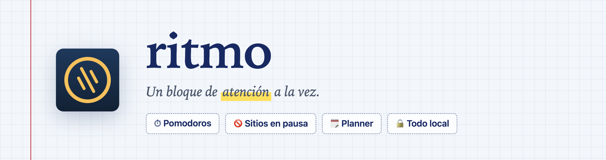
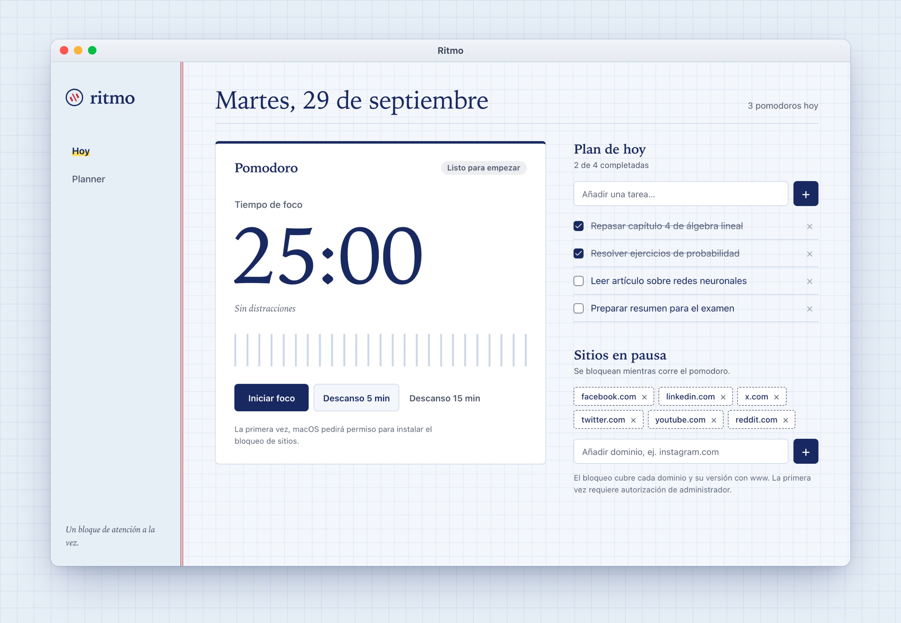
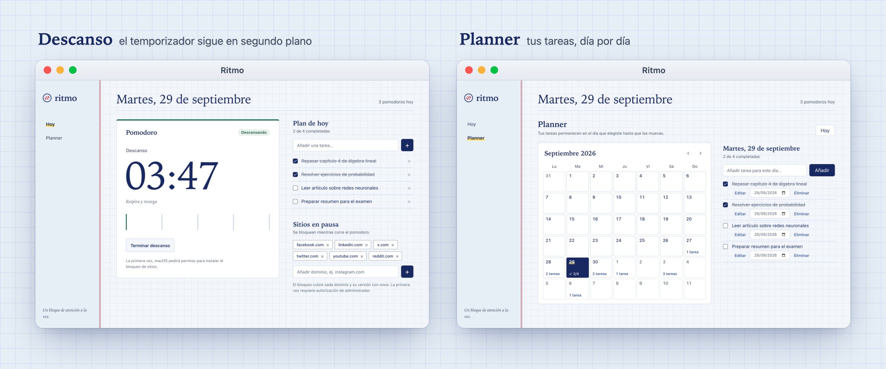

> Pomodoros, tareas del día, sitios en pausa y rutas de estudio, en una sola app para macOS.
> Una herramienta personal para estudiar con foco y llevar la cuenta de cada sesión.



## ✨ Qué hace

| Función | Qué hace |
| --- | --- |
| ⏱️ **Foco** | Sesiones de 25 minutos con descansos de 5 o 15. Al terminar suena una señal y llega una notificación, aunque Ritmo esté en segundo plano. |
| 🚫 **Sitios en pausa** | Bloquea redes sociales y cualquier dominio que añadas mientras dura el foco. |
| 🗓️ **Planner** | Tareas por día y un calendario mensual para completarlas y moverlas de fecha. Las pendientes esperan en su día hasta que las muevas. |
| ✅ **Seguimiento** | Un contador de pomodoros del día, que vuelve a cero cada día. |
| 🧭 **Rutas de estudio** | El roadmap de un tema: objetivo, nivel, pomodoros al día, etapas con sus temas e instrucciones para el agente. Las tareas del Planner se vinculan a una etapa y cada etapa muestra su avance. |
| 🤖 **Tareas propuestas** | Claude Code o Codex proponen las próximas tareas de una ruta según su roadmap (etapas, proyectos, recursos y reglas de estudio) y tu avance. Las revisas, las editas y eliges el día antes de añadirlas al Planner. |
| 🔒 **Todo local** | Sin cuentas, servidores ni sincronización. Solo sale del Mac lo que envías al agente cuando pulsas «Proponer tareas». |



## 🚀 Empezar

Necesitas macOS, Node.js 24 (ver `.nvmrc`) y npm.

```bash
npm install
npm start
```

> 🔐 En el primer pomodoro, macOS pide una autorización de administrador para instalar el helper que bloquea los sitios; después no vuelve a pedirla. Cómo funciona, qué riesgos implica y cómo desinstalarlo: [`docs/bloqueo-de-sitios.md`](docs/bloqueo-de-sitios.md).

## 🧭 Rutas de estudio con Claude Code o Codex

En **Rutas** creas una ruta y la divides en etapas. Al pulsar «Proponer tareas», Ritmo lanza el CLI del agente elegido en **Ajustes** y le pide un JSON con hasta 10 tareas: título, etapa, pomodoros, cuándo está hecha y por qué. Las propuestas se quedan «a lápiz» hasta que las añades al Planner, vinculadas a su etapa; completarlas hace avanzar la etapa, y la siguiente petición lo tiene en cuenta.

- **Con tu suscripción, no con la API.** Ritmo usa la sesión de `claude` o `codex` que ya tienes iniciada y quita del entorno del CLI `ANTHROPIC_API_KEY`, `OPENAI_API_KEY` y similares. Si el CLI no tiene sesión o usa una clave de API, Ajustes te dice cómo resolverlo. Las peticiones cuentan para los límites de uso de tu plan; por defecto van con un modelo ligero (`haiku` o `gpt-6-luna`), que puedes cambiar.
- **Encuentra el CLI.** Una app abierta desde Finder no hereda el `PATH` de la terminal, así que Ritmo busca el ejecutable en `~/.local/bin`, Homebrew, npm y otras carpetas habituales, y en el `PATH` de tu shell. En Ajustes puedes fijar la ruta y el modelo de cada uno.
- **Sin permisos.** El agente responde sin herramientas (Claude Code) o con un sandbox de solo lectura (Codex), en un directorio temporal que se borra al terminar. Cada petición tiene un tiempo máximo de 3 minutos y se puede cancelar; al cerrar Ritmo también se cancela. Una respuesta que no cumple el esquema da un error claro y no crea nada.
- **Privacidad.** Antes de la primera petición a cada proveedor, Ritmo te dice qué le enviará: el tema, el objetivo, el nivel, las etapas y las instrucciones de la ruta, y el título, el día y el estado de sus tareas. Nada se envía sin que pulses el botón.

Desde la terminal, Claude Code o Codex también pueden leer tus rutas y añadir tareas con el servidor MCP de Ritmo, mientras la app está abierta. Cómo registrarlo: [`docs/desarrollo.md`](docs/desarrollo.md#servidor-mcp).

## 🛠️ Desarrollo

| Comando | Qué hace |
| --- | --- |
| `npm start` | Compila a `out/` con electron-vite y abre la app |
| `npm run dev` | Abre la app con recarga en caliente de la interfaz |
| `npm run typecheck` | Comprueba los tipos sin generar archivos |
| `npm test` | Compila y ejecuta todas las pruebas |
| `npm run coverage` | Pruebas con cobertura (c8); falla bajo los umbrales de `.c8rc.json` |

**Stack:** Electron · React · Tailwind CSS · shadcn/ui · SQLite · TypeScript

El código está en `src/`: `main/` (proceso principal, en módulos por contexto), `preload/` (API limitada para la interfaz), `renderer/` (React), `shared/` (contratos y validaciones) y `mcp/` (el servidor MCP para Claude Code y Codex); los scripts del bloqueo y el icono, en `resources/`. Cada PR hacia `main` pasa el check `ci` (`npm ci`, `npm run typecheck` y `npm test` en macOS).

📚 [Arquitectura](docs/arquitectura.md) · [Glosario](docs/glosario.md) · [Desarrollo](docs/desarrollo.md) · [Bloqueo de sitios](docs/bloqueo-de-sitios.md) · [Pautas para agentes](AGENTS.md)

## 🤖 Hecho con IA

Todo el código, las pruebas y la documentación los generaron agentes de IA. Mi papel es definir qué quiero, revisar el resultado y decidir qué se integra. Está pensado para mi uso personal y no ha pasado por la revisión de un proyecto mantenido para terceros.
