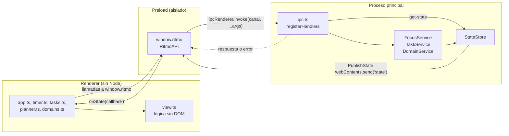
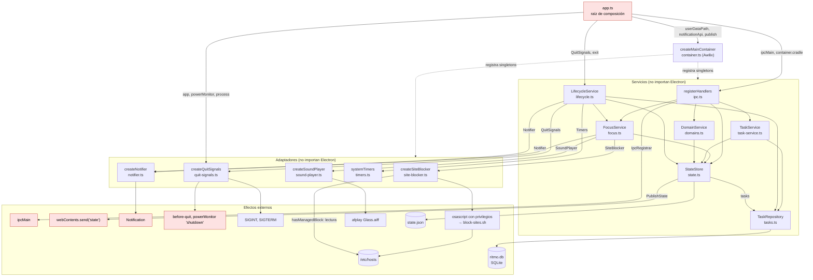
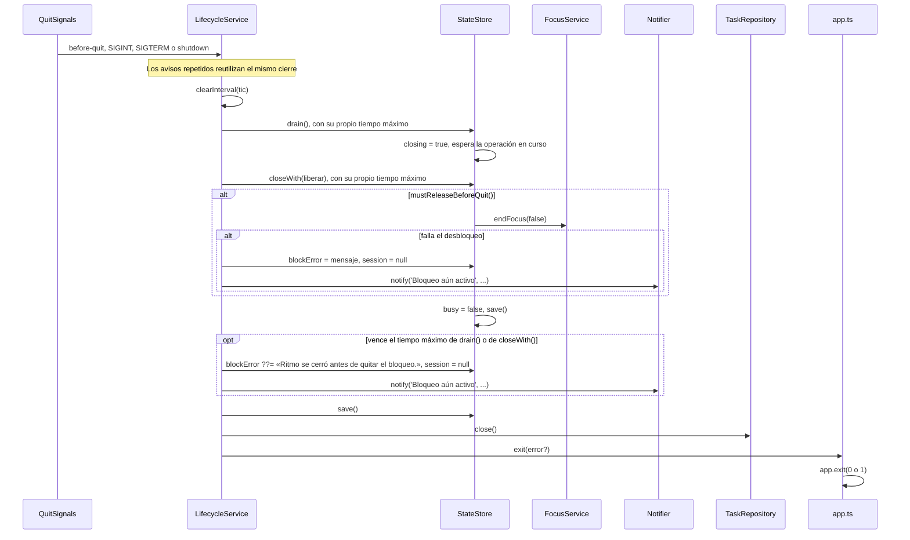
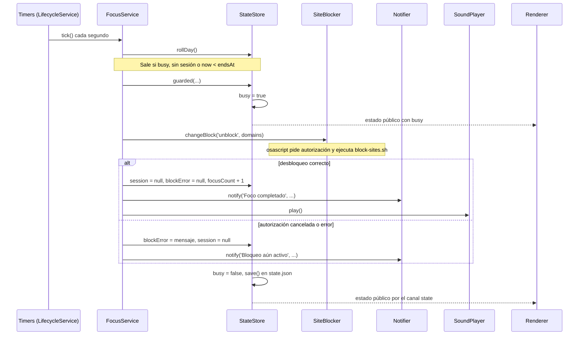

# Arquitectura

Cómo se conectan los procesos de Electron, los servicios del proceso principal, sus puertos y sus adaptadores, y cómo avanza una sesión. Los términos se definen en [`glosario.md`](glosario.md).

Si cambias un puerto, un servicio, su registro en `src/main/container.ts`, su cableado en `src/main/app.ts` o el ciclo de una sesión, actualiza estos diagramas en el mismo cambio.

## 1. Procesos

El renderer no tiene acceso a Node ni a Electron. Todo pasa por `window.ritmo`, que `preload.ts` expone con `contextBridge`. Cada método, salvo `onState()`, invoca un canal IPC; `ipc.ts` lo conecta con un servicio, que valida la entrada. El estado vuelve por un solo canal, `state`, que `onState()` escucha, cada vez que `StateStore` guarda o empieza una operación protegida.

Canales: `get-state`, `start-focus`, `finish-focus`, `retry-unblock`, `start-break`, `finish-break`, `add-task`, `toggle-task`, `delete-task`, `get-tasks-for-day`, `update-task`, `add-domain` y `remove-domain`, en `invoke`, y `state`, que va del proceso principal al renderer. `retry-unblock` y `finish-focus` llaman al mismo método, `FocusService.finishFocus()`. `test/contract/` comprueba que `RitmoAPI`, `preload.ts` e `ipc.ts` sigan sincronizados.

## 2. Servicios y dependencias

`src/main/app.ts` es la raíz de composición. Crea con `createMainContainer()` (`src/main/container.ts`, Awilix) un contenedor en el que todo es singleton, le pasa lo que viene de Electron (`userData`, `Notification` y la función que publica el estado) y resuelve de él `lifecycle`. Después conecta las vías de salida con el cierre ordenado, registra los manejadores IPC con `ipcMain` y el propio `container.cradle`. Solo `app.ts` y `preload.ts` importan `electron`, y solo `container.ts` importa Awilix. Los servicios no conocen el contenedor: las fábricas de `container.ts` llaman a sus constructores de forma explícita y los servicios reciben lo de Electron a través de los puertos de `ports.ts`.

En rojo, lo que depende de Electron. Las flechas continuas son dependencias en tiempo de ejecución, rotuladas con el puerto cuando lo hay; las discontinuas indican que `container.ts` registra el módulo. `registerHandlers()` no está en el contenedor: lo llama `app.ts`.

Registros de `createMainContainer()`:

| Registro | Fábrica | Puertos sin inyectar |
| --- | --- | --- |
| `userDataPath`, `publish`, `notificationApi` | Valores que pasa `app.ts`: `app.getPath('userData')`, la función que envía el estado por `webContents.send('state', …)` si la ventana existe, y `Notification` de Electron. | — |
| `now` | Valor: `options.now`, o `Date.now` si no se pasa (`app.ts` no lo pasa). | — |
| `timers` | Valor: `options.timers`, o `systemTimers` si no se pasa (`app.ts` no lo pasa). | — |
| `shutdownTimeoutMs` | Valor: `options.shutdownTimeoutMs`; sin él, `LifecycleService` usa `DEFAULT_SHUTDOWN_TIMEOUT_MS` (125 s por fase del cierre). | — |
| `blocker` | `createSiteBlocker()` | — |
| `notifier` | `createNotifier(notificationApi)` | — |
| `sound` | `createSoundPlayer()` | — |
| `taskRepository` | `new TaskRepository(<userData>/ritmo.db, { now })`; lo cierran el cierre ordenado y `container.dispose()` (`close()` es idempotente). | `IdGenerator` (`crypto.randomUUID`) |
| `store` | `new StateStore(<userData>/state.json, { tasks: taskRepository, publish, now })` | — |
| `focus` | `new FocusService(store, { blocker, notifier, sound })` | — |
| `tasks` | `new TaskService(store, taskRepository)` | — |
| `domains` | `new DomainService(store)` | — |
| `lifecycle` | `new LifecycleService({ store, focus, notifier, tasks: taskRepository, timers, shutdownTimeoutMs })` | — |

Orden de arranque en `app.ts`: se crea el contenedor y se resuelve `lifecycle` (con él, `store`, `focus`, el repositorio y los adaptadores). `lifecycle.listen()` conecta `createQuitSignals({ app, powerMonitor, process })` con el cierre ordenado; después vienen `registerHandlers(ipcMain, container.cradle)` y la ventana. Por último, `lifecycle.start()` llama a `focus.recover()` y `store.rollDay()`, hace un primer `focus.tick()`, que cierra de inmediato una sesión que venció con la app cerrada, y programa el tic cada segundo con `Timers`.

Cierre ordenado: `before-quit` (Cmd+Q, o `app.quit()` al cerrar la última ventana fuera de macOS), `SIGINT`, `SIGTERM` y el `shutdown` de `powerMonitor` llaman a `LifecycleService.shutdown()`, que se ejecuta una sola vez. `before-quit` y `shutdown` se cancelan para que el cierre termine antes; al acabar, `app.exit()` sale sin volver a emitir `before-quit` ni `will-quit`.

## 3. Ciclo de una sesión

Estados que ve el usuario y transiciones entre ellos. Los estados en cursiva ocurren dentro de `StateStore.guarded()`: `busy` es `true`, la interfaz desactiva los controles y `tick()` no hace nada hasta que terminan. Cada operación protegida guarda y publica el estado al acabar, también si falla.

`recover()` no toca un descanso guardado. Si además encuentra la sección gestionada, marca `blockError` y la interfaz muestra **Bloqueo pendiente** hasta que se quite. Un foco guardado que venció con la app cerrada se cierra en el primer `tick()` tras el arranque.

Al cerrar la app con **Foco** o **Bloqueo pendiente**, el cierre ordenado intenta desbloquear. Si lo consigue, la app sale en **Listo**. Si falla, o si vence el tiempo máximo, la app sale igualmente con `blockError` guardado en `state.json`, sin el foco y tras notificar «Bloqueo aún activo». Descartar el foco evita que, al reabrir después de su fin, el tic lo cuente como pomodoro. En el siguiente arranque, `recover()` lleva a **Bloqueo pendiente** si la sección gestionada sigue en `/etc/hosts`, y a **Listo** si macOS terminó de quitarla.

Secuencia del cierre de un pomodoro por el tic, con el camino de error:

Si al descanso le toca terminar, el mismo `tick()` pone `session = null` y notifica «Descanso terminado», sin tocar el bloqueo.
