# Arquitectura

Cómo se conectan los procesos de Electron, los servicios del proceso principal, sus puertos y sus adaptadores, y cómo avanza una sesión. Los términos se definen en [`glosario.md`](glosario.md).

Si cambias un puerto, un servicio o su interfaz, un módulo, su registro en `src/main/container.ts`, su cableado en `src/main/app.ts` o el ciclo de una sesión, actualiza estos diagramas en el mismo cambio.

## 1. Procesos

El renderer no tiene acceso a Node ni a Electron. Todo pasa por `window.ritmo`, que `src/preload/index.ts` expone con `contextBridge`. Cada método, salvo `onState()`, invoca un canal IPC; el `ipc.ts` del módulo dueño del canal lo conecta con su servicio, que valida la entrada, e `ipc/register.ts` compone esos registros. Los handlers devuelven `IpcResult` (los envuelve `createHandle()`, de `ipc/handle.ts`): los errores `PublicError` conservan un mensaje útil; las excepciones inesperadas se registran en el proceso principal y cruzan IPC sin detalle. Preload convierte los fallos, incluidos los de `ipcRenderer.invoke`, en `ApiError`; el renderer solo muestra esos mensajes. El estado vuelve por un solo canal, `state`, que `onState()` escucha, cada vez que `StateStore` guarda o empieza una operación protegida. `StateStore.publicState()` reemplaza cualquier `blockError` guardado por una indicación fija con la acción de recuperación.

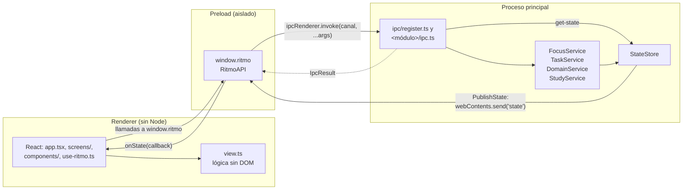

Canales: `get-state` (`state`), `start-focus`, `finish-focus`, `start-break` y `finish-break` (`focus`), `add-task`, `toggle-task`, `delete-task`, `get-tasks-for-day`, `get-task-summary` y `update-task` (`tasks`), `add-domain`, `remove-domain` y `retry-unblock` (`blocking`), y `list-study-routes`, `create-study-route`, `update-study-route`, `delete-study-route` y `get-study-progress` (`study`), en `invoke`, y `state`, que va del proceso principal al renderer. `retry-unblock` y `finish-focus` llaman al mismo método, `FocusService.finishFocus()`. `add-task` y `update-task` aceptan el vínculo de la tarea con una etapa; `get-study-progress` devuelve el avance de todas las etapas, por `stageId`, en una consulta. `get-task-summary` devuelve el resumen de tareas del rango que muestra el calendario del Planner en una sola consulta, en lugar de pedir cada día con `get-tasks-for-day`. `test/contract/` comprueba que `RitmoAPI`, el preload e `ipc/register.ts` sigan sincronizados.

### 1.1 Contratos compartidos

Lo que cruza procesos está en `src/shared/`, con un contrato por módulo en `src/shared/<módulo>/contract.ts` (`focus`, `tasks`, `blocking`, `state` y `study`). Cada uno declara sus tipos, su parte de `AppState`, la API que ofrece al renderer, sus canales IPC y la validación de su entrada, que usan los servicios del proceso principal y la vista. `study/contract.ts` es el contrato de las rutas de estudio (#36): por ahora su API crea, edita, lista y borra rutas y da el avance de sus etapas según las tareas vinculadas (`tasks/contract.ts` define el vínculo, `TaskLink`), y la pantalla Rutas del renderer (`screens/study-screen.tsx`) la usa para editarlas con la lógica sin DOM de `view.ts`. `src/shared/ipc.ts` guarda lo común a todos los canales: `PublicError`, `IpcResult`, `ApiError` y los tipos auxiliares `ChannelMap` y `UnvalidatedArgs`. `src/shared/api.ts` solo compone: `RitmoAPI`, `RitmoChannels`, `RitmoEvents` y el tipo de `window.ritmo`.

Los canales son solo tipos: el preload se ejecuta con sandbox y no puede cargar módulos locales, así que importa los contratos con `import type` y repite `GENERIC_ERROR_MESSAGE`. `ChannelMap` asigna a cada método de la API de un módulo su canal y toma de él la firma. Con `RitmoChannels`, el preload solo compila si invoca un canal existente con los argumentos de su método, y el `ipc.ts` de cada módulo solo si registra canales de su propio contrato con la misma aridad, porque recibe un `Handle<FocusChannels>` (o el de su módulo); allí los argumentos llegan como `unknown` y los valida el servicio.

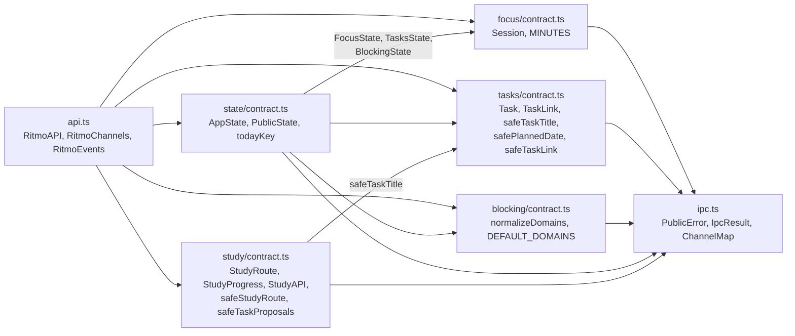

## 2. Servicios y dependencias

`src/main/app.ts` es la raíz de composición. Crea con `createMainContainer()` (`src/main/container.ts`, Awilix) un contenedor en el que todo es singleton, le pasa lo que viene de Electron (`userData`, la carpeta `resources/`, `Notification` y la función que publica el estado) y resuelve de él `lifecycle`. Después conecta las vías de salida con el cierre ordenado, registra los manejadores IPC con `ipcMain` y el propio `container.cradle`. Solo `app.ts` y el preload importan `electron`, y solo `container.ts` importa Awilix. Los servicios no conocen el contenedor: las fábricas de `container.ts` llaman a sus constructores de forma explícita y los servicios reciben lo de Electron a través de puertos.

`src/main/` está dividido en módulos por contexto (`common/`, `state/`, `focus/`, `blocking/`, `tasks/`, `study/`, `lifecycle/` e `ipc/`; ver «Módulos» en el [glosario](glosario.md)). Cada módulo declara en su `ports.ts` los puertos de salida que necesita y las interfaces de su servicio (`StateStorePort`, `PublicStatePort`, `StateShutdownPort`, `FocusServicePort`, `FocusLifecyclePort`, `TaskServicePort`, `StudyTasksPort`, `DomainServicePort`, `StudyServicePort`, `LifecycleServicePort`), que la clase implementa. Cada consumidor recibe solo la interfaz con lo que usa. Los consumidores, `MainCradle` incluido, dependen solo de esas interfaces, y los módulos se importan entre sí solo a través de `ports.ts`: `container.ts` es el único que construye las clases de servicio.

El grafo de dependencias se divide en vistas: composición, entrada por IPC, servicios entre sí y adaptadores con sus efectos externos. En todas, en rojo va lo que depende de Electron; las flechas continuas son dependencias en tiempo de ejecución, rotuladas con el puerto o la interfaz de servicio por la que pasan, y las discontinuas indican que `container.ts` registra el módulo.

### 2.1 Composición

Qué crea `app.ts`, qué le pasa al contenedor y qué conecta él mismo. `registerHandlers()` y `createQuitSignals()` no están en el contenedor: los llama `app.ts`.

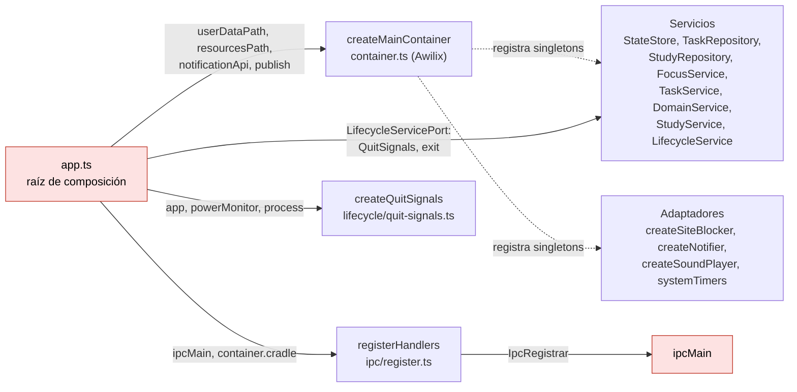

Registros de `createMainContainer()`. En `MainCradle`, los servicios y los repositorios se tipan con su interfaz: `taskRepository` como `TaskRepositoryPort`, `studyRepository` como `StudyRepositoryPort & StudyStagesPort`, `store` como `StateStorePort & PublicStatePort & StateShutdownPort`, `focus` como `FocusServicePort & FocusLifecyclePort`, `tasks` como `TaskServicePort & StudyTasksPort`, `domains` como `DomainServicePort`, `study` como `StudyServicePort` y `lifecycle` como `LifecycleServicePort`.

| Registro | Fábrica | Puertos sin inyectar |
| --- | --- | --- |
| `userDataPath`, `resourcesPath`, `publish`, `notificationApi` | Valores que pasa `app.ts`: `app.getPath('userData')`, `<app.getAppPath()>/resources` (con `block-sites.sh`, `install-block-helper.sh` y el icono), la función que envía el estado por `webContents.send('state', …)` si la ventana existe, y `Notification` de Electron. | — |
| `now` | Valor: `options.now`, o `Date.now` si no se pasa (`app.ts` no lo pasa). | — |
| `timers` | Valor: `options.timers`, o `systemTimers` si no se pasa (`app.ts` no lo pasa). | — |
| `shutdownTimeoutMs` | Valor: `options.shutdownTimeoutMs`; sin él, `LifecycleService` usa `DEFAULT_SHUTDOWN_TIMEOUT_MS` (160 s por fase del cierre). | — |
| `blocker` | `createSiteBlocker(resourcesPath)` | — |
| `notifier` | `createNotifier(notificationApi)` | — |
| `sound` | `createSoundPlayer()` | — |
| `taskRepository` | `new TaskRepository(<userData>/ritmo.db, { now })`; lo cierran el cierre ordenado y `container.dispose()` (`close()` es idempotente). | `IdGenerator` (`crypto.randomUUID`) |
| `studyRepository` | `new StudyRepository(<userData>/ritmo.db, { now })`, con su propia conexión al mismo archivo; lo cierran el cierre ordenado y `container.dispose()` (`close()` es idempotente). | `IdGenerator` (`crypto.randomUUID`) |
| `store` | `new StateStore(<userData>/state.json, { tasks: taskRepository, publish, now })` | — |
| `focus` | `new FocusService(store, { blocker, notifier, sound })` | — |
| `tasks` | `new TaskService(store, taskRepository, studyRepository)` | — |
| `domains` | `new DomainService(store)` | — |
| `study` | `new StudyService(studyRepository, tasks)` | — |
| `lifecycle` | `new LifecycleService({ store, focus, notifier, databases: [taskRepository, studyRepository], timers, shutdownTimeoutMs })` | — |

Orden de arranque en `app.ts`: se crea el contenedor y se resuelve `lifecycle` (con él, `store`, `focus`, los repositorios y los adaptadores). `lifecycle.listen()` conecta `createQuitSignals({ app, powerMonitor, process })` con el cierre ordenado; después vienen `registerHandlers(ipcMain, container.cradle)` y la ventana. Por último, `lifecycle.start()` llama a `focus.recover()` y `store.rollDay()`, hace un primer `focus.tick()`, que cierra de inmediato una sesión que venció con la app cerrada, y programa el tic cada segundo con `Timers`.

### 2.2 De IPC a los servicios

`registerHandlers()` (`ipc/register.ts`) solo compone: crea con `createHandle(ipcMain)` un `Handle` por módulo, tipado con los canales de su contrato, y se lo pasa al `ipc.ts` del módulo junto con la interfaz de su servicio, no la clase. `createHandle()` envuelve cada manejador para devolver `IpcResult`. `retry-unblock` pertenece al contrato de `blocking`, pero llama a `FocusService.finishFocus()`, así que `registerBlockingIpc()` recibe también esa parte de `FocusServicePort`.

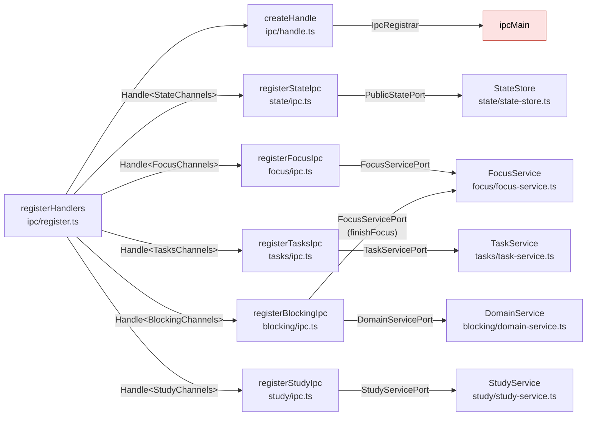

### 2.3 Entre servicios

Los servicios guardan a través de `StateStore`, salvo `StudyService`, que usa su repositorio y pide a `TaskService` (`StudyTasksPort`) el avance de las etapas y que desvincule las tareas de las etapas que se quitan, para que las tareas de hoy queden al día. `TaskService` comprueba con `StudyStagesPort`, que implementa `StudyRepository`, que la etapa de un vínculo existe. `LifecycleService` depende de `FocusService` y cierra las dos conexiones SQLite como `Database`.

`study/ports.ts` declara también `StudyAgent`, el puerto del CLI que propondrá tareas (Claude Code o Codex). `study/agent-prompt.ts` tiene lo que comparten sus adaptadores: `buildAgentRequest()` arma el prompt y el esquema JSON de la respuesta a partir de `StudyAgentContext` (la ruta, sus tareas vinculadas y el día), y `readAgentProposals()` valida la salida con `safeTaskProposals()`. El adaptador de Claude Code, `ClaudeCodeAgent` (`study/claude-code-agent.ts`), lanza `claude -p` sin herramientas y con salida JSON según ese esquema mediante `runAgentCli()` (`study/agent-cli.ts`), que ejecuta el CLI sin shell en un directorio temporal, con tiempo máximo, límite de salida y cancelación por `AbortSignal`, y termina todo su grupo de procesos al acabar. `runAgentCli()` quita del entorno del CLI las claves de API (`agentEnv()`), para que use la sesión del usuario con su suscripción y no facture por API, y cada adaptador comprueba antes esa sesión (`claude auth status`, `codex login status`): sin ella, rechaza con «Inicia sesión en Claude Code/Codex…» sin enviar la petición. El de Codex, `CodexAgent` (`study/codex-agent.ts`), lanza `codex exec` con el mismo lanzador en un sandbox de solo lectura, sin guardar la sesión ni leer la configuración del usuario; como `codex` toma el esquema de un archivo y escribe la respuesta en otro, `runAgentCli()` escribe los archivos de la petición en el directorio temporal y lee el de la respuesta antes de borrarlo. Aún no tienen consumidor, así que no está en el contenedor; las pruebas usan `FakeStudyAgent` y prueban los adaptadores con un ejecutable falso.

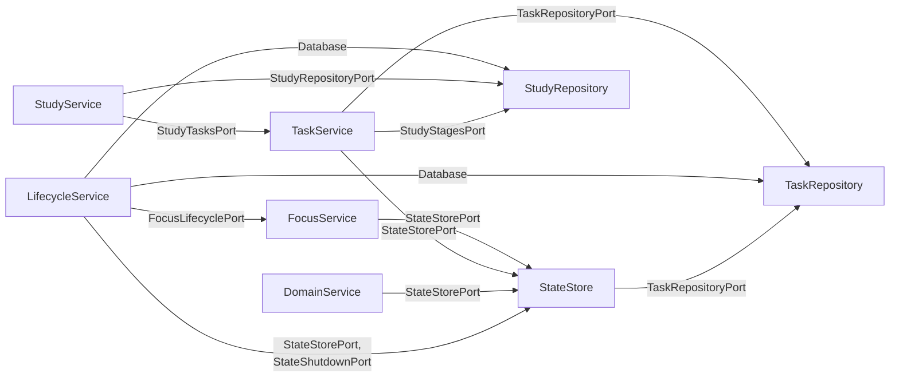

### 2.4 Foco y bloqueo: adaptadores y efectos externos

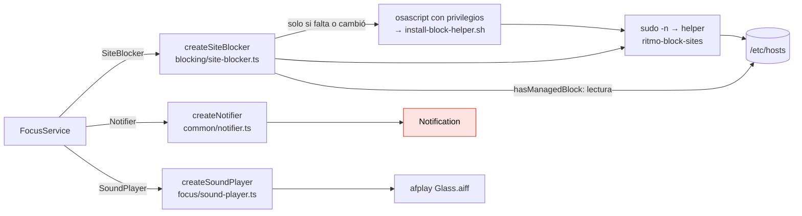

### 2.5 Estado, tareas, rutas y ciclo de vida: adaptadores y efectos externos

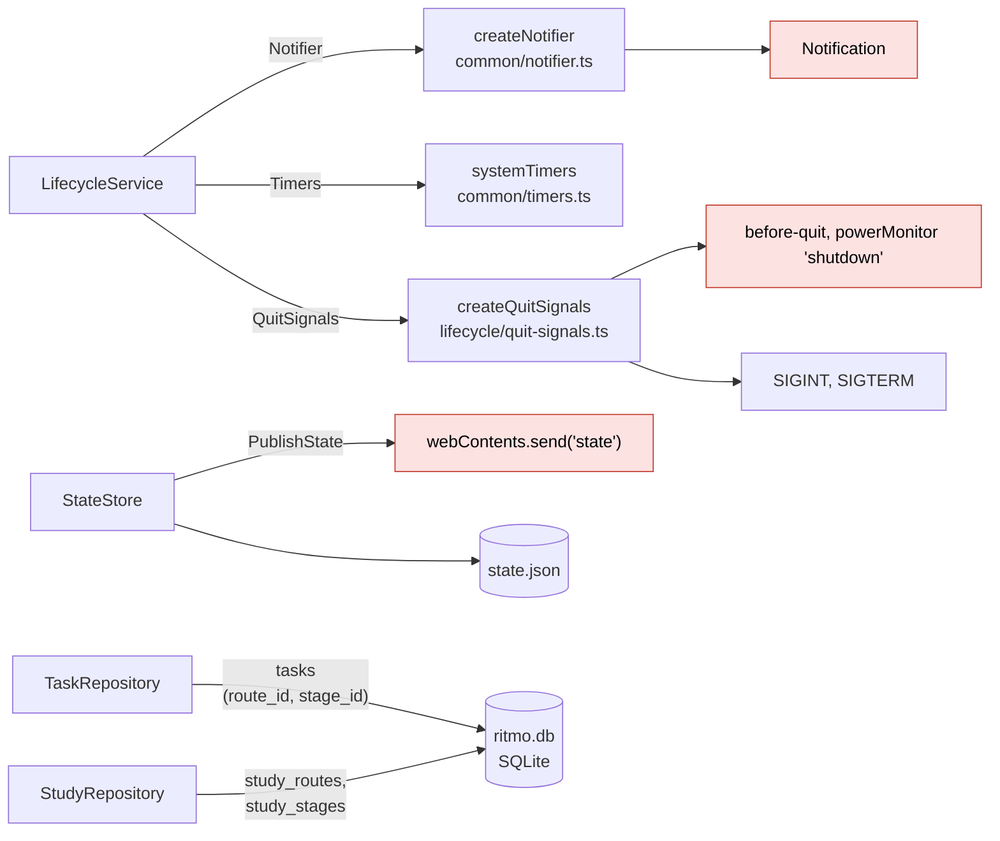

### 2.6 Cierre ordenado

`before-quit` (Cmd+Q, o `app.quit()` al cerrar la última ventana fuera de macOS), `SIGINT`, `SIGTERM` y el `shutdown` de `powerMonitor` llaman a `LifecycleService.shutdown()`, que se ejecuta una sola vez. `before-quit` y `shutdown` se cancelan para que el cierre termine antes; al acabar, `app.exit()` sale sin volver a emitir `before-quit` ni `will-quit`.

Camino habitual, incluido el desbloqueo al salir con un foco o un bloqueo pendiente:

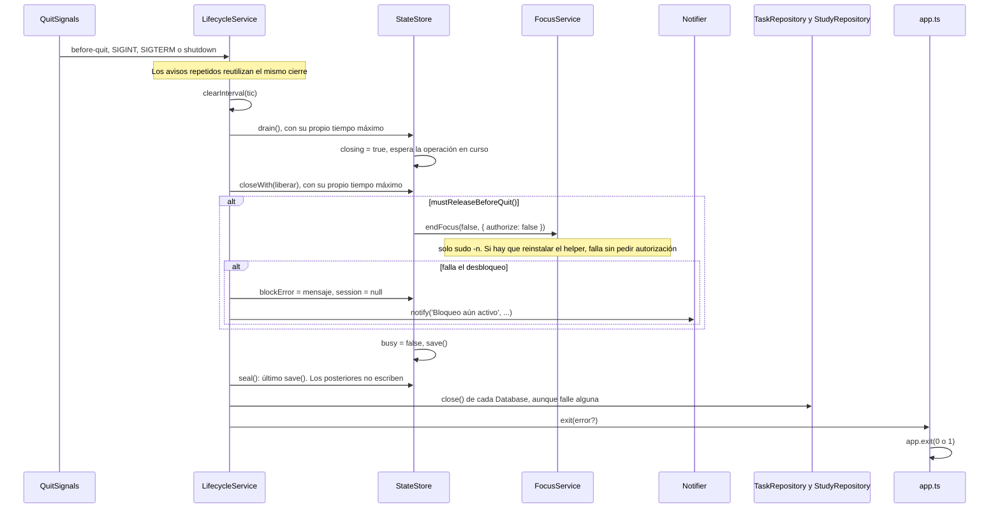

Si vence el tiempo máximo de `drain()` o de `closeWith()`, antes de `seal()`:

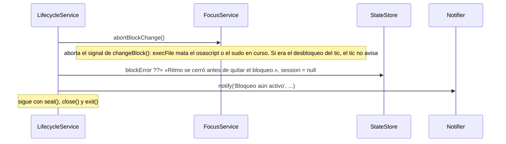

## 3. Ciclo de una sesión

Estados que ve el usuario y transiciones entre ellos. Los estados en cursiva ocurren dentro de `StateStore.guarded()`: `busy` es `true`, la interfaz desactiva los controles y `tick()` no hace nada hasta que terminan. Cada operación protegida guarda y publica el estado al acabar, también si falla.

### 3.1 Arranque

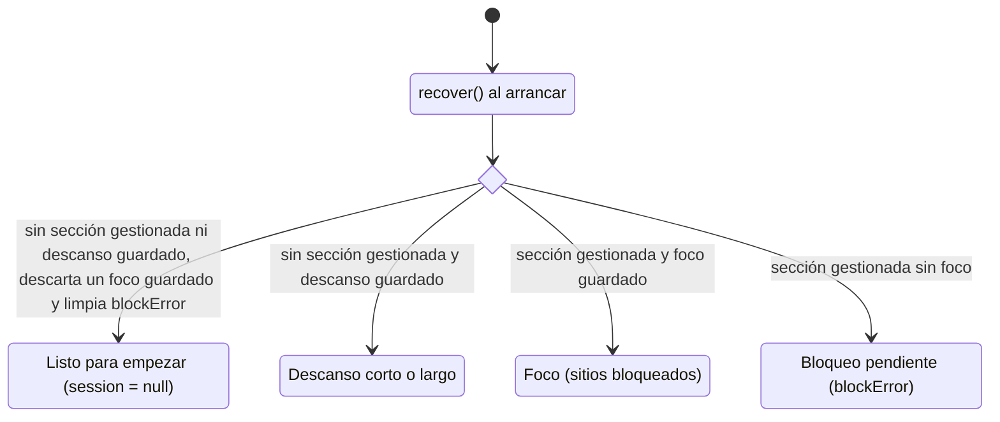

`recover()` no toca un descanso guardado. Si además encuentra la sección gestionada, marca `blockError` y la interfaz muestra **Bloqueo pendiente** hasta que se quite. Un foco guardado que venció con la app cerrada se cierra en el primer `tick()` tras el arranque.

### 3.2 Foco y bloqueo

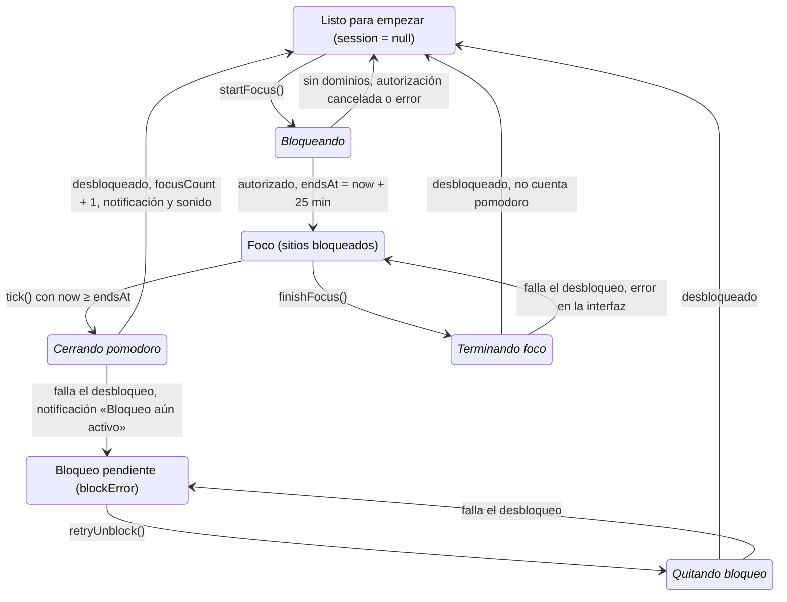

### 3.3 Descanso

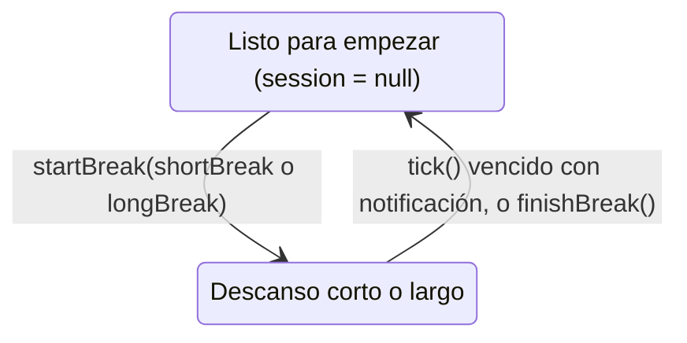

### 3.4 Al cerrar la app

Al cerrar la app con **Foco** o **Bloqueo pendiente**, el cierre ordenado intenta desbloquear con el helper instalado, sin pedir autorización: si hay que reinstalarlo, el desbloqueo falla y queda pendiente. Si lo consigue, la app sale en **Listo**. Si vence el tiempo máximo, cancela antes el cambio de bloqueo en curso, lo que cierra el diálogo de administrador y termina `sudo`: un desbloqueo queda pendiente y un foco que se estaba iniciando se descarta sin aviso. Si el helper ya estaba escribiendo `/etc/hosts`, termina la escritura aunque se cancele, así que ese foco puede quedar aplicado sin constar en `state.json`; la ventana es de milisegundos, y al reabrir `recover()` lo deja en **Bloqueo pendiente**. Si falla el desbloqueo, o si vence el tiempo máximo con un foco activo o un bloqueo pendiente, la app sale igualmente con `blockError` guardado en `state.json`, sin el foco y tras notificar «Bloqueo aún activo». Descartar el foco evita que, al reabrir después de su fin, el tic lo cuente como pomodoro. En el siguiente arranque, `recover()` lleva a **Bloqueo pendiente** si la sección gestionada sigue en `/etc/hosts`, y a **Listo** si macOS terminó de quitarla. `block-sites.sh` termina al recibir una señal antes de escribir `/etc/hosts` y la ignora mientras lo escribe, así que una cancelación nunca lo deja a medias.

### 3.5 Cierre de un pomodoro por el tic

Secuencia con el camino de error:

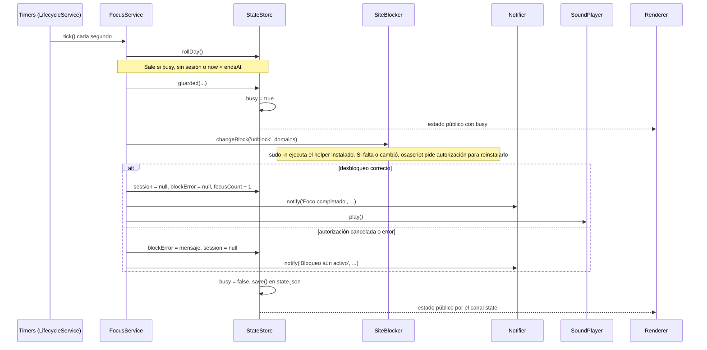

Si al descanso le toca terminar, el mismo `tick()` pone `session = null` y notifica «Descanso terminado», sin tocar el bloqueo.
