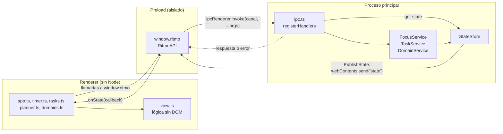
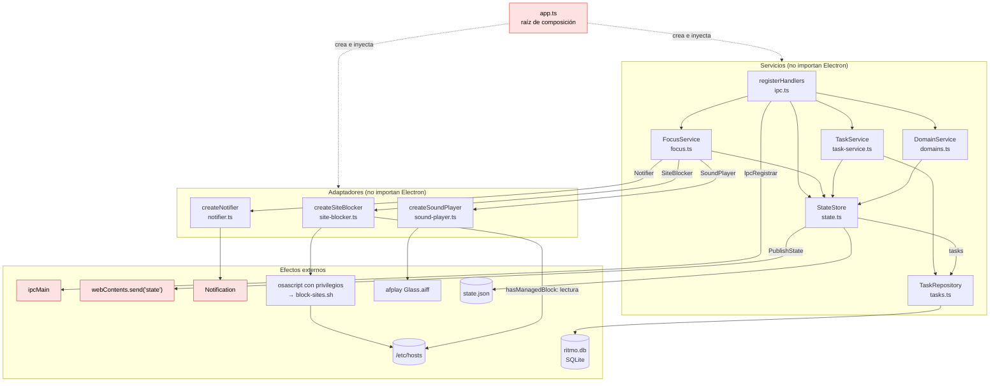
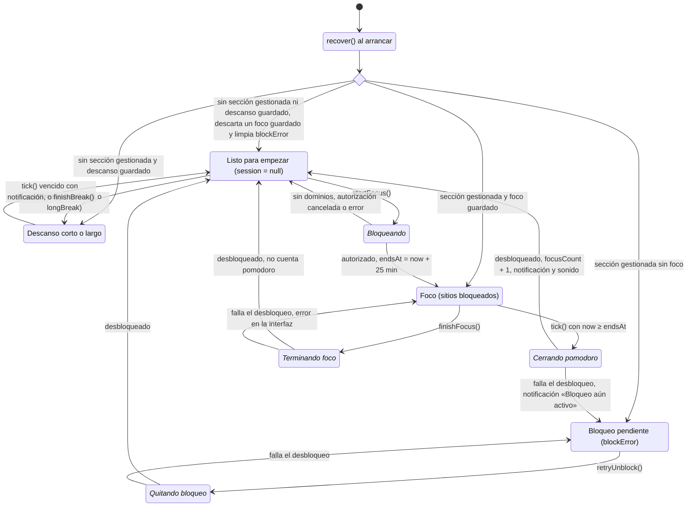
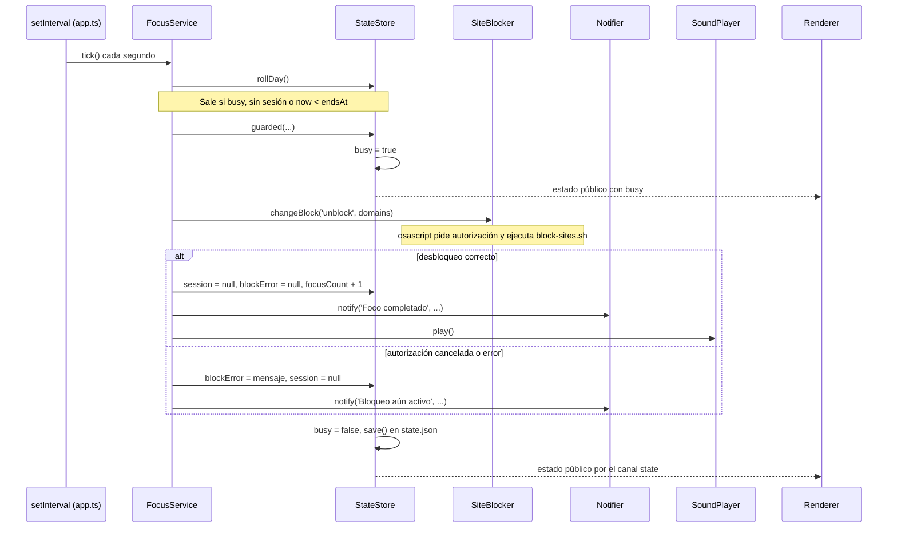

# Arquitectura

Cómo se conectan los procesos de Electron, los servicios del proceso principal, sus puertos y sus adaptadores, y cómo avanza una sesión. Los términos se definen en [`glosario.md`](glosario.md).

Si cambias un puerto, un servicio, su cableado en `src/main/app.ts` o el ciclo de una sesión, actualiza estos diagramas en el mismo cambio.

## 1. Procesos

El renderer no tiene acceso a Node ni a Electron. Todo pasa por `window.ritmo`, que `preload.ts` expone con `contextBridge`. Cada método invoca un canal IPC; `ipc.ts` lo conecta con un servicio, que valida la entrada. El estado vuelve por un solo canal, `state`, cada vez que `StateStore` guarda o empieza una operación protegida.

Canales: `get-state`, `start-focus`, `finish-focus`, `retry-unblock`, `start-break`, `finish-break`, `add-task`, `toggle-task`, `delete-task`, `get-tasks-for-day`, `update-task`, `add-domain` y `remove-domain`, en `invoke`, y `state`, que va del proceso principal al renderer. `retry-unblock` y `finish-focus` llaman al mismo método, `FocusService.finishFocus()`. `test/contract/` comprueba que `RitmoAPI`, `preload.ts` e `ipc.ts` sigan sincronizados.

## 2. Servicios y dependencias

`src/main/app.ts` es la raíz de composición: crea las implementaciones reales y las inyecta. Solo `app.ts` y `preload.ts` importan `electron`; el resto de módulos de `src/main/` recibe lo que necesita de Electron (`ipcMain`, `Notification`, `webContents.send`) a través de los puertos de `ports.ts`.

En rojo, lo que depende de Electron. Las flechas continuas son dependencias en tiempo de ejecución, rotuladas con el puerto cuando lo hay; las discontinuas indican que `app.ts` crea el módulo.

Cableado exacto de `app.ts`:

| Módulo | Cómo lo crea `app.ts` | Puertos sin inyectar |
| --- | --- | --- |
| `TaskRepository` | `new TaskRepository(<userData>/ritmo.db)` | `Clock` (`Date.now`) e `IdGenerator` (`crypto.randomUUID`) toman su valor por defecto. |
| `StateStore` | `new StateStore(<userData>/state.json, { tasks, publish })`; `publish` envía el estado por `webContents.send('state', …)` si la ventana existe. | `Clock` (`Date.now`). |
| `FocusService` | `new FocusService(store, { blocker: createSiteBlocker(), notifier: createNotifier(Notification), sound: createSoundPlayer() })` | — |
| `TaskService` | `new TaskService(store, tasks)` | — |
| `DomainService` | `new DomainService(store)` | — |
| Manejadores IPC | `registerHandlers(ipcMain, { store, focus, tasks: TaskService, domains: DomainService })` | — |

Orden de arranque: repositorio y almacén, `focus.recover()`, manejadores IPC, ventana, `store.rollDay()`, cierre inmediato de un foco que venció con la app cerrada, e intervalo de 1 s que llama a `focus.tick()`. En `before-quit`, si `mustReleaseBeforeQuit()`, la app desbloquea dentro de `guarded` antes de salir. `app.ts` usa `Date.now()` directamente al arrancar; los servicios usan `store.now()`.

## 3. Ciclo de una sesión

Estados que ve el usuario y transiciones entre ellos. Los estados en cursiva ocurren dentro de `StateStore.guarded()`: `busy` es `true`, la interfaz desactiva los controles y `tick()` no hace nada hasta que terminan. Cada operación protegida guarda y publica el estado al acabar, también si falla.

`recover()` no toca un descanso guardado. Si además encuentra la sección gestionada, marca `blockError` y la interfaz muestra **Bloqueo pendiente** hasta que se quite. Un foco guardado que venció con la app cerrada se cierra en el primer `tick()` tras el arranque.

Al cerrar la app con **Foco** o **Bloqueo pendiente**, `before-quit` intenta desbloquear. Si lo consigue, la app sale; si no, guarda el error en `blockError`, muestra la ventana y un diálogo, y la app sigue abierta en **Bloqueo pendiente**.

Secuencia del cierre de un pomodoro por el tic, con el camino de error:

Si al descanso le toca terminar, el mismo `tick()` pone `session = null` y notifica «Descanso terminado», sin tocar el bloqueo.
